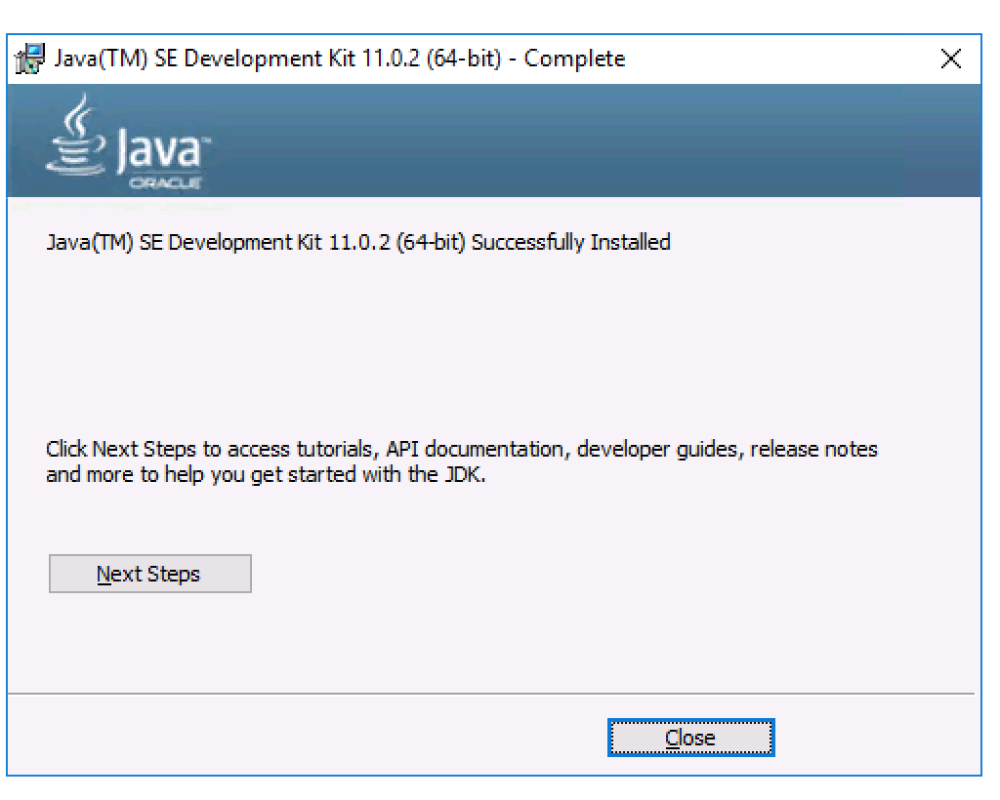
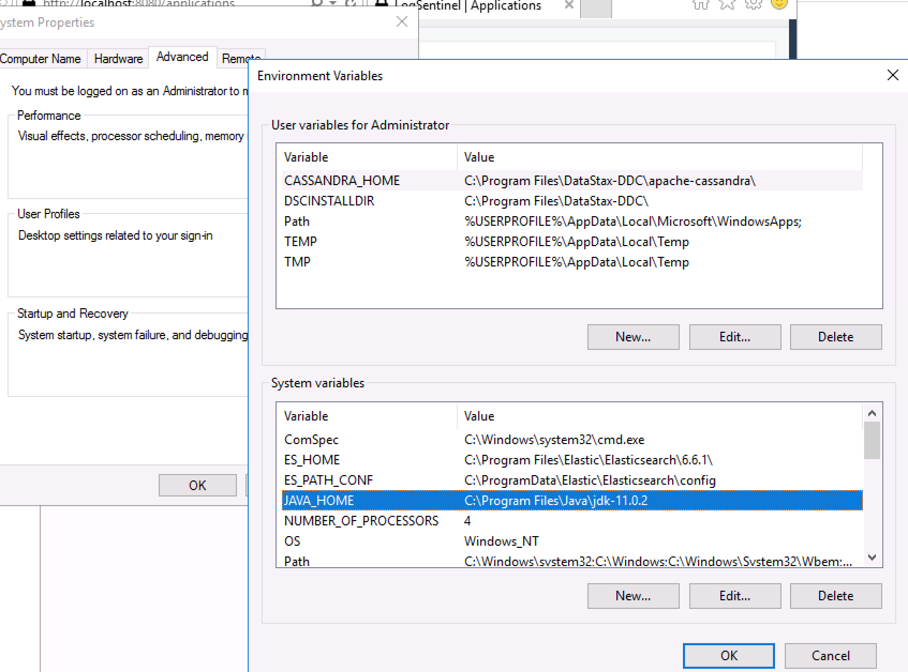
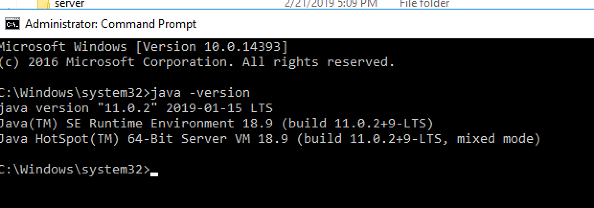
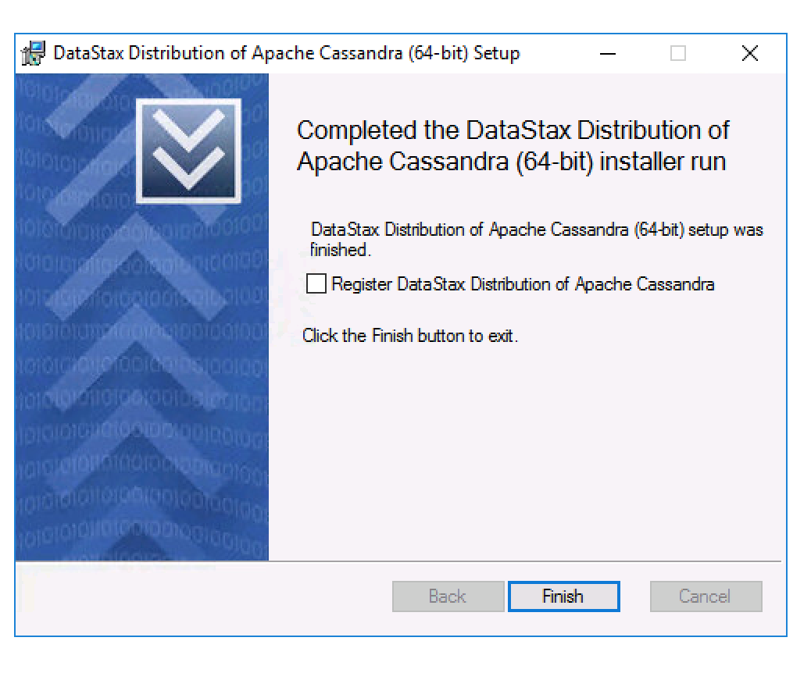
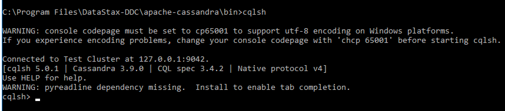
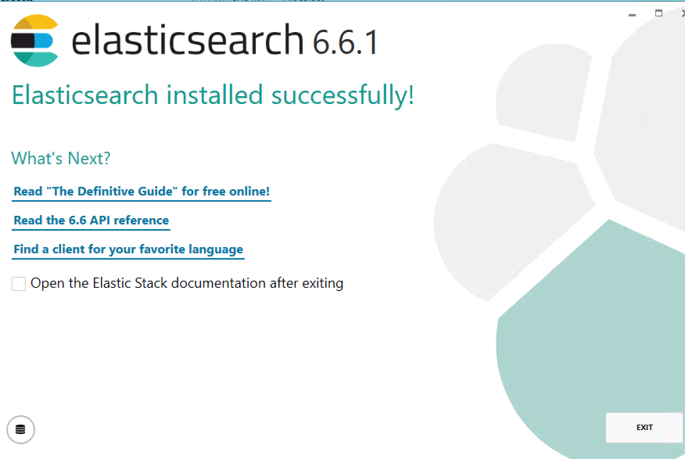
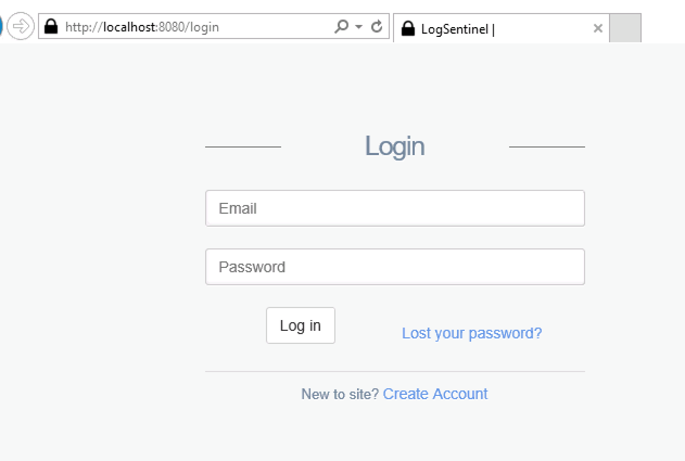

On-premise Installation on Windows
==================================

SentinelTrails can be installed on-premise for enterprise customers. It can be done as part of a contract by our staff, or internally by the staff of your company. Below are the instructions for the latter scenario.

Prerequisites
*************

Before you begin installation, you should make sure the following prerequisites are met:

* You have downloaded the JDK installer https://www.oracle.com/technetwork/java/javase/downloads/jdk11-downloads-5066655.html (jdk-11.0.2_windows-x64_bin.exe)
* You have downloaded the ElasticSearch installer https://s3-eu-west-1.amazonaws.com/logsentinel-public/elasticsearch-6.6.1.msi
* You have downloaded the Cassandra installer https://s3-eu-west-1.amazonaws.com/logsentinel-public/datastax-ddc-64bit-3.9.0-install.msi
* You have downloaded the logsentinel installer zip (obtained via your LogSentinel account manager)

Installing Java
***************
* Run the JDK installer (jdk-11.0.2_windows-x64_bin.exe) and follow the instructions. 

* Make sure the PATH is configured properly

* To make sure Java is installed, run cmd and type “java -version”

Installing Cassandra
********************
Cassandra for Windows is packaged in the Datastax DCC. Run the installer (datastax-ddc-64bit-3.9.0-install.msi) and follow the instructions.

To make sure Cassandra is installed and running, run cqlsh.

Finally, create a keyspace:

``CREATE KEYSPACE IF NOT EXISTS logsentinel WITH REPLICATION = { 'class': 'SimpleStrategy', 'replication_factor': 1 } AND DURABLE_WRITES =  true;``

Installing ElasticSearch
************************
Run elasticsearch-6.6.1.msi and follow the instructions.

To make sure ElasticSearch is installed and running, open http://localhost:9200/ in a browser

You may need to create a ``log`` folder under ``C:\Program Files\Elastic\Elasticsearch\6.6.1``

Installing LogSentinel’s SentinelTrails
***************************************

Extract the logsentinel-installer.zip archive in c:\logsentinel and run install.bat (you need to have administrative privileges). Then make sure the service has been installed.

.. image:: logsentinel-service.png

Edit application.properties by setting:
* ``root.url`` – http://{the domain name to be used for the service}. It can set to http://localhost:8080 initially and changed later
* ``admin.password`` – password for the admin user
* ``spring.mail.*`` properties to configure outgoing email settings (can be set at a later stage)

Go to “Services” and start the LogSentinel service.
Open http://localhost:8080 (or the address that you configured) 

Finally, use admin@logsentinel.com/{admin password} to log in to the administrative account.

